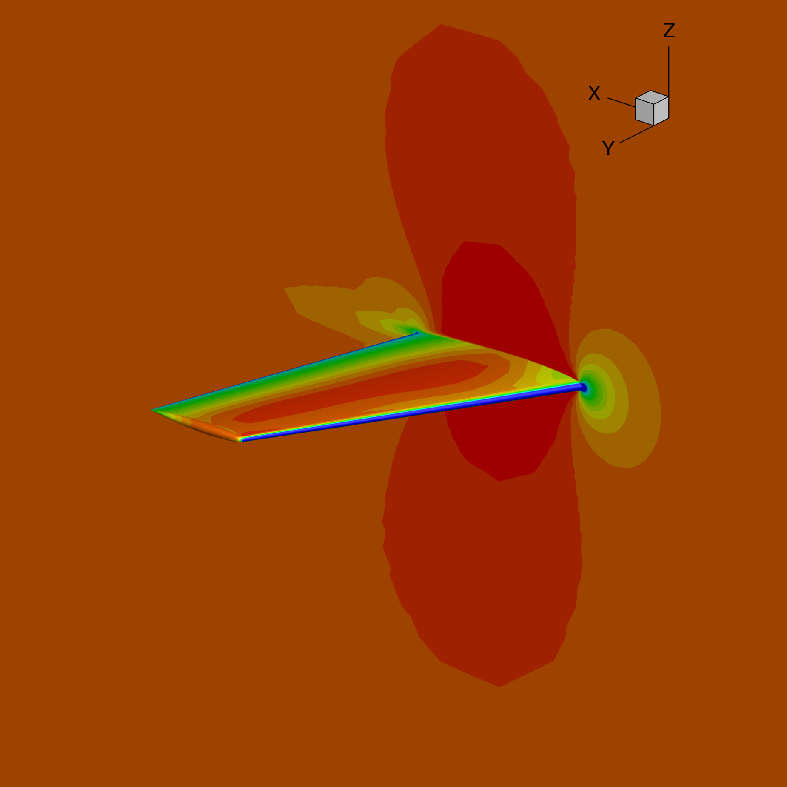

# VTKPlot: A VTK equivalent of Tecplot 360 Visualization with View Magnification

This package provides a VTK-based visualization tool for Tecplot data files with multiple "view magnification" methods that simulate Tecplot 360's automatic view focusing.



## Installation

### From source

```bash
git clone https://github.com/idolikecfd/vtkplot.git
cd vtkplot
pip install -e .
```

### Using pip

```bash
pip install git+https://https://github.com/idolikecfd/vtkplot.git
```

## Usage

The script reads a Tecplot layout file (.lay) which contains camera settings and a reference to the data file (.dat).

Basic usage (default: mesh refinement magnification):
```bash
vtkplot layout_file.lay
```

Specify a different magnification method as a subcommand:
```bash
vtkplot layout_file.lay statistical
```

To disable magnification:
```bash
vtkplot layout_file.lay none
```

**Note:** The layout file should contain a reference to the data file in the format:
```
$!VarSet |LFDSFN1| = '"data_file.dat"'
```

### Magnification Methods

1. **Statistical Magnification**
   - Focuses on the middle 90% of data points, excluding outliers
   - Syntax: `statistical [options]`
   - Options:
     - `--percentile-cutoff` - Cutoff for outlier removal (default: 0.05, meaning exclude 5% on each end)

2. **Variability Magnification**
   - Focuses on regions with high gradient values
   - Syntax: `variability [options]`
   - Options:
     - `--scalar-name` - Name of the scalar field to analyze (default: "u")
     - `--gradient-percentile` - Percentile for high gradients (default: 0.9, meaning top 10%)

3. **Field Range Magnification**
   - Focuses on specific scalar field value ranges
   - Syntax: `field_range [options]`
   - Options:
     - `--scalar-name` - Name of the scalar field to analyze (default: "u") 
     - `--min-percentile` - Lower percentile for field range (default: 0.25)
     - `--max-percentile` - Upper percentile for field range (default: 0.75)

4. **Bounding Box Magnification**
   - Adjusts the view based on the bounding box of active blocks
   - Syntax: `bounding_box [options]`
   - Options:
     - `--padding-factor` - Adds padding around bounds (default: 0.05, adds 5% padding)

5. **Mesh Refinement Magnification** (DEFAULT)
   - Focuses on regions with highest mesh refinement (smallest cells)
   - Syntax: `mesh_refinement [options]`
   - Options:
     - `--percentile-threshold` - Threshold for smallest cells (default: 0.1, meaning smallest 10%)
     - `--min-cells` - Minimum cells for refinement region (default: 10)

6. **No Magnification**
   - Uses standard VTK camera setting without special magnification
   - Syntax: `none`

## Examples

### Using example data

The package includes example data files in the `examples/` directory:

```bash
# Run with default mesh refinement magnification
vtkplot examples/om6.lay

# Try different magnification methods
vtkplot examples/om6.lay statistical
vtkplot examples/om6.lay variability
vtkplot examples/om6.lay none
```

### Advanced usage

Statistical magnification with 3% outlier cutoff:
```bash
vtkplot layout_file.lay statistical --percentile-cutoff 0.03
```

Variability magnification focusing on top 5% of gradients:
```bash
vtkplot layout_file.lay variability --gradient-percentile 0.95
```

Field range magnification focusing on the middle 30% of values:
```bash
vtkplot layout_file.lay field_range --min-percentile 0.35 --max-percentile 0.65
```

Bounding box magnification with 10% padding:
```bash
vtkplot layout_file.lay bounding_box --padding-factor 0.10
```

Mesh refinement magnification focusing on smallest 5% of cells:
```bash
vtkplot layout_file.lay mesh_refinement --percentile-threshold 0.05
```

## Notes on Tecplot View Magnification

The Tecplot 360 "View Magnification" feature automatically focuses the view on the most informative part of the data. This package provides multiple approaches to simulate this behavior:

1. The statistical approach removes outliers for a cleaner view
2. The variability approach focuses on regions with high field gradients
3. The field range approach focuses on specific value ranges of interest
4. The bounding box approach provides a simpler but effective option
5. The mesh refinement approach focuses on areas with the smallest cells (highest refinement), which is particularly useful for CFD simulations where the mesh is refined in critical regions like boundary layers, shock waves, or regions of complex flow

Experiment with different methods to find the one that best replicates the Tecplot 360 behavior for your specific data.

## Package Structure

```
vtkplot/
├── pyproject.toml          # Package configuration
├── README.md               # This file
├── LICENSE                 # License file
├── .gitignore              # Git ignore file
├── examples/               # Example data files
│   ├── om6.dat            # Example Tecplot data file
│   ├── om6.lay            # Example Tecplot layout file
│   └── om6.png            # Example output
└── vtkplot/                # Main package directory
    ├── __init__.py         # Package initialization
    ├── core.py             # Core visualization functionality
    ├── cli.py              # Command-line interface
    └── magnification/      # Magnification methods
        ├── __init__.py
        ├── statistical.py      # Percentile-based filtering
        ├── variability.py      # High gradient regions focus
        ├── field_range.py      # Specific value ranges focus
        ├── bounding_box.py     # Bounding box with padding
        └── mesh_refinement.py  # Smallest cells focus
```
